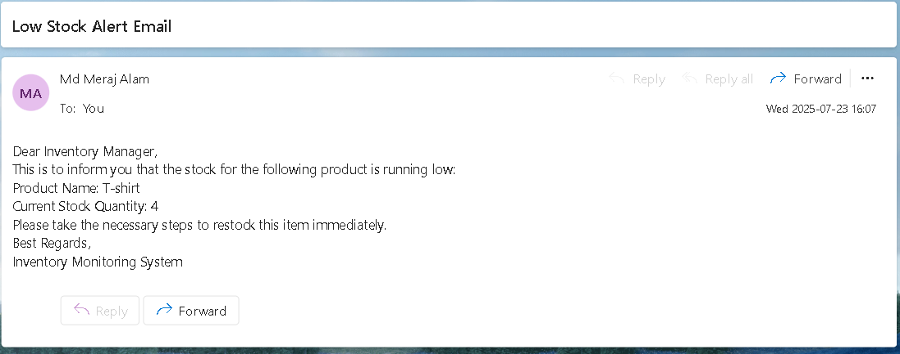

   
  <h1>🧵 HANDSMEN THREADS</h1>
  

    <em>Elevating the Art of Sophistication in Men's Fashion with Salesforce-powered digital transformation.</em>
  

  

    
    
    
    
  

# HandsMen Threads: Elevating the Art of Sophistication in Men's Fashion  

---

## ✨ What is HandsMen Threads?

HandsMen Threads is a Salesforce-powered digital transformation solution for a modern fashion brand. It is built to:
- Centralize business-critical data
- Automate workflows across sales, support, and inventory
- Enable real-time insights and better collaboration

The aim is to elevate backend efficiency while creating a seamless experience for customers and internal teams alike.

---

## 🛠️ Key Features

- **Automated Order Confirmations**  
  Instantly notifies customers with email confirmations post-purchase.

- **Dynamic Loyalty Program**  
  Loyalty tiers are updated automatically based on user behavior.

- **Proactive Stock Alerts**  
  Inventory thresholds automatically trigger alerts below 5 units.

- **Scheduled Bulk Order Processing**  
  Apex batch jobs handle bulk order and inventory updates every night.

---

## ABSTRACT  

The project presents the implementation of a customized Salesforce CRM solution for HandsMen Threads, a premium men's fashion and tailoring brand. The objective was to streamline business operations, enhance customer engagement, and maintain data integrity across departments.
The solution involves designing a robust data model featuring five key custom objects: Customer, Order, Product, Inventory, and Marketing Campaign. Business processes were automatically focused: Triggered Flows, Scheduled Flows, Partial Arms, and Apex to handle other confirmations, highly status updates, and proactive stock alerts.
To ensure clean and reliable data, validation rules were established, and a role-based security model was implemented in the Sales, Inventory, and Marketing teams. The solution also includes a scheduled batch job using Apex to enable new sales quantities.
This end-to-end CRM implementation improves customer experience through personalized communication, ensures operational efficiency with automation, and lays a scalable foundation for future business growth using the Salesforce Platform.

## OBJECTIVE

The main objective of this project is to develop and implement a customized Salesforce CRM validator for Handwake Threads to streamline core business operations, maintain data integrity, and enhance customer satisfaction.
By building a centralized system to manage customers, orders, products, inventory, and marketing campaigns, the project aims to:
•	Automatic key processes such as order confirmations, loyalty status updates, and stock alerts.
•	Ensure accurate and consistent data entry using validation rules.
•	Enable real-time visibility of inventory and customer interactions.
•	Improve internal team coordination through role-based access control.
•	Deliver personalized customer experiences through targeted communication and loyalty programs.

## TECHNOLOGY DESCRIPTION

### Salesforce :
Salesforce is a cloud-based Customer Relationship Management (CRM) platform that helps businesses manage customer data, automate processes, and improve service, marketing, and sales operations. It provides paths and click tools as well as programmatic capabilities (like APIs and Flows) to build custom business solutions.

### Custom Objects :

Objects in Salesforce are like tables in a database. Custom Objects are created to store specific data.

Example:

•	Customer_ c – Stores customer info

•	Product_ c – Stores product details

•	Order_ c – Stores orders 

Handsmen Customers object 
  
Handsmen Products object
 
 

Handsmen Orders object
 
  
Inventorys object

  

### Tabs :

Tabs are used to display object data in the Salesforce UI.
Example: A lab for Product_ c allows users to easily view and manage products.
 
  

### Custom App : 
An App in Salesforce is a collection of tabs grouped together for a specific business purpose.
### Profiles : 
Profiles define what a user can see, do, and edit in Salesforce. It controls object permissions, field access, and more.  
### Roles : 
Roles control the data visibility in Salesforce's role hierarchy. It's used for sharing settings and reporting.  
### Permission Sets : 
Permission Sets grant additional permissions to users without changing their profile.  
 
### Validation Rules : 
Validation Rules ensure data entered meets business criteria. 
Example: 
•	Email must contain @gmail.com 
•	Stock cannot be negative 

### Email Templates : 
Predefined formats for sending emails to customers or users. 
Example: 
•	"Order Confirmation" template 
   

### Email Alerts : 
Email Alerts are actions in Flows or Workflow Rules that send emails using predefined templates. 
Example:  When a loyalty level changes, an email is sent to the customer. 
Low Stock Email alert. 

 
  

 
   

### Flows : 
Flows automate business logic without code. They can create, update, or send notifications. 
Example: 
•	Flow triggers email alerts on new order  
### Apex : 
Apex is Salesforce's object-oriented programming language. It allows developers to write custom logic. 
Example:  Triggers: 
•	Update Total_Amount_of in order 
•	Reduce inventory stock  

## CONCLUSION 
The HandsMen Threads CRM system built on Salesforce successfully streamlines key business processes like customer management, product cataloging, order processing, inventory tracking, and loyalty program automation. By leveraging Salesforce tools like Custom Objects, Flows, Validation Rules, and Apex, the system ensures accurate data entry, real-time updates, and enhanced customer experience. Through automation and well-structured user roles, the platform minimizes manual errors, speeds up operations, and provides better insights into sales and stock.

